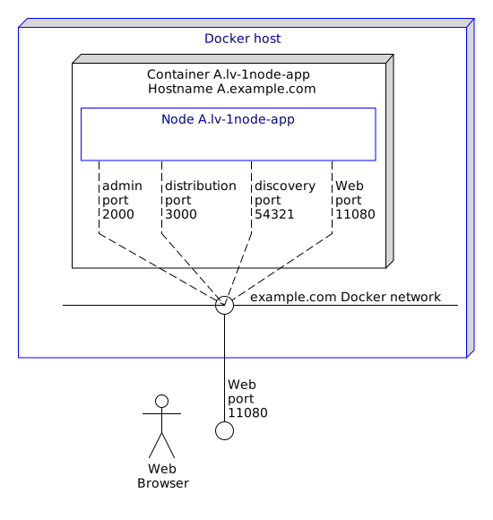

# Docker : TIBCO LiveView&trade; Web

This sample describes how to deploy an application archive containing a TIBCO LiveView&trade; Web fragment to Docker.

* [Prerequisites](#prerequisites)
* [Creating an application archive project for Docker from TIBCO StreamBase Studio&trade;](#creating-an-application-archive-project-for-docker-from-tibco-streambase-studio-trade)
* [Containers and nodes](#containers-and-nodes)
* [Changes to the default docker configurations](#changes-to-the-default-docker-configurations)
* [Building and running from TIBCO StreamBase Studio&trade;](#building-and-running-from-tibco-streambase-studio-trade)
* [Building this sample from the command line and running the integration test cases](#building-this-sample-from-the-command-line-and-running-the-integration-test-cases)
* [Example docker commands](#example-docker-commands)

See also [Docker section in TIBCO&reg; Streaming documentation](https://docs.tibco.com/pub/str/10.4.0/doc/html/admin/part-docker.html).

<a name="prerequisites"></a>

## Prerequisites

Docker must first be downloaded and installed - see https://www.docker.com/ for further details.

On MacOS, the resources available to docker may need to be increased beyond the default - see
CPUs and Memory settings on the Advanced tab of Docker preferences.

<a name="creating-an-application-archive-project-for-docker-from-tibco-streambase-studio-trade"></a>

## Creating an application archive project for Docker from TIBCO StreamBase Studio&trade;

TIBCO StreamBase Studio&trade; can generate a project containing the necessary files to build and 
test a Docker image by selecting **Enable Docker support** when creating an application archive project :


Such a project includes :

* A [base Dockerfile](../../main/docker/base/Dockerfile) to build a base image containing Linux, utilities and the TIBCO StreamBase runtime
* A [start-node](../../main/docker/base/start-node) script to start a node
* An [application Dockerfile](../../main/docker/application/Dockerfile) to build an application image containing the application archive - this is based on the base image
* Steps in [pom.xml](../../../pom.xml) that uses [fabric8io/docker-maven-plugin](http://dmp.fabric8.io/) to build the Docker image and start Docker containers for basic testing
* [Trusted hosts HOCON configuration](../../main/configurations/security.conf) so that each container can run epadmin commands on the cluster
* [Application definition configuration](../../main/configurations/app.conf) that defines nodeType docker to use System V shared memory
* [Node deployment configuration](../../main/configurations/defaultnode.conf) that uses the above nodeType

Note that whilst this project will create a simple Docker image, changes to the project may be required for additional behaviours. 

<a name="containers-and-nodes"></a>

## Containers and nodes

In this sample we name the docker container as **A.lv-1node-app**,  which hosts the StreamBase node **A.lv-1node-app**, the TIBCO LiveView&trade; Web port 
10080 is published to the host :



<a name="changes-to-the-default-docker-configurations"></a>

## Changes to the default docker configurations

In this sample we still want to build the application archive if Docker is not
installed, hence the maven [pom.xml](../../../pom.xml) file is updated to detect if docker is installed :

```xml
    <properties>
        <dockerDomain>example.com</dockerDomain>
        <skipApplicationDocker>true</skipApplicationDocker>
        <skipStreamBaseDockerBase>true</skipStreamBaseDockerBase>
        <skipDockerTests>true</skipDockerTests>
    </properties>
    ...
    <!-- if docker is available, build docker projects -->
    <profile>
        <id>Docker in local</id>
        <activation>
            <file>
                <exists>/usr/local/bin/docker</exists>
            </file>
        </activation>
        <properties>
            <skipApplicationDocker>false</skipApplicationDocker>
            <skipStreamBaseDockerBase>false</skipStreamBaseDockerBase>
            <skipDockerTests>${skipTests}</skipDockerTests>
        </properties>
    </profile>
    <profile>
        <id>Docker in bin</id>
        <activation>
            <file>
                <exists>/usr/bin/docker</exists>
            </file>
        </activation>
        <properties>
            <skipApplicationDocker>false</skipApplicationDocker>
            <skipStreamBaseDockerBase>false</skipStreamBaseDockerBase>
            <skipDockerTests>${skipTests}</skipDockerTests>
        </properties>
    </profile>
    <profile>
        <id>Docker in C:</id>
        <activation>
            <file>
                <exists>C:\Program Files\Docker\Docker\resources\bin\docker.exe</exists>
            </file>
        </activation>
        <properties>
            <skipApplicationDocker>false</skipApplicationDocker>
            <skipStreamBaseDockerBase>false</skipStreamBaseDockerBase>
            <skipDockerTests>${skipTests}</skipDockerTests>
        </properties>
    </profile>
```

Since this application starts a Web Server we need to expose the port outside of Docker during
integration testing and wait until the web server is running :

```
    <ports> 
        <port>10080:10080</port>
    </ports>
    ...
    <wait>
        <http>
            <url>http://localhost:10080</url>
            <method>GET</method>
            <status>200..399</status>
        </http>
        <time>500000</time>
    </wait>
```

<a name="building-and-running-from-tibco-streambase-studio-trade"></a>

## Building and running from TIBCO StreamBase Studio&trade;

Use the **Run As -> Maven install** menu option to build from TIBCO StreamBase Studio&trade; or Run As shortcut.  Tests can
be skipped if required by ticking the **Skip tests** :


The [Docker tooling](https://marketplace.eclipse.org/content/eclipse-docker-tooling) eclipse plugin
( requires [TM Terminal](https://marketplace.eclipse.org/content/tm-terminal) ) can be used to start and
manage containers :


<a name="building-this-sample-from-the-command-line-and-running-the-integration-test-cases"></a>

## Building this sample from the command line and running the integration test cases

Use the [maven](https://maven.apache.org) as **mvn install** to build from the command line or Continuous Integration system :


<a name="example-docker-commands"></a>

## Example docker commands

### Create the docker network

Use the [docker network](https://docs.docker.com/engine/reference/commandline/network_create/) command :

```
$ docker network create example.com
03961870a96df30e7e20cf54a3c339b6d7a1e0b344d0833f4c7f88dfaba76138
```

### Start the container

Use the [docker run](https://docs.docker.com/engine/reference/run/) command.  In this case the following options are used :

* **--detach** - run in the background
* **--hostname=A.example.com --network-alias=A.example.com --network=example.com** - set the container hostname and network name. This must match the docker network name and the [Trusted hosts HOCON configuration](../../main/configurations/security.conf)
* **--name=A.lv-1node-app** - container name
* **--env=NODENAME=A.lv-1node-app** - node name
* **--publish 10080:10080** - publish the TIBCO LiveView&trade; Web port to the host
* **docker/lv-1node-app:1.0.0** - Docker image name

```shell
$ docker run --detach --hostname=A.example.com --network-alias=A.example.com --name=A.lv-1node-app --network=example.com --env=NODENAME=A.lv-1node-app --publish 10080:10080 docker/lv-1node-app:1.0.0
ec0aaaa22b92707e74f15b9ada6e6c37c14669856744e88ebc1741b2b099cc0d
```

### Connect to the TIBCO LiveView&trade; Web console

Use a web browser at http://localhost:10080/ :


### Stop and remove the containers

Use the [docker stop](https://docs.docker.com/engine/reference/commandline/stop/) and [docker rm](https://docs.docker.com/engine/reference/commandline/rm/) commands :

```shell
$ docker stop A.lv-1node-app
$ docker rm A.lv-1node-app
```

---
Copyright (c) 2018-2023 Cloud Software Group, Inc.

Redistribution and use in source and binary forms, with or without
modification, are permitted provided that the following conditions are met:

* Redistributions of source code must retain the above copyright notice, this
  list of conditions and the following disclaimer.

* Redistributions in binary form must reproduce the above copyright notice,
  this list of conditions and the following disclaimer in the documentation
  and/or other materials provided with the distribution.

* Neither the name of the copyright holder nor the names of its
  contributors may be used to endorse or promote products derived from
  this software without specific prior written permission.

THIS SOFTWARE IS PROVIDED BY THE COPYRIGHT HOLDERS AND CONTRIBUTORS "AS IS"
AND ANY EXPRESS OR IMPLIED WARRANTIES, INCLUDING, BUT NOT LIMITED TO, THE
IMPLIED WARRANTIES OF MERCHANTABILITY AND FITNESS FOR A PARTICULAR PURPOSE ARE
DISCLAIMED. IN NO EVENT SHALL THE COPYRIGHT HOLDER OR CONTRIBUTORS BE LIABLE
FOR ANY DIRECT, INDIRECT, INCIDENTAL, SPECIAL, EXEMPLARY, OR CONSEQUENTIAL
DAMAGES (INCLUDING, BUT NOT LIMITED TO, PROCUREMENT OF SUBSTITUTE GOODS OR
SERVICES; LOSS OF USE, DATA, OR PROFITS; OR BUSINESS INTERRUPTION) HOWEVER
CAUSED AND ON ANY THEORY OF LIABILITY, WHETHER IN CONTRACT, STRICT LIABILITY,
OR TORT (INCLUDING NEGLIGENCE OR OTHERWISE) ARISING IN ANY WAY OUT OF THE USE
OF THIS SOFTWARE, EVEN IF ADVISED OF THE POSSIBILITY OF SUCH DAMAGE.
