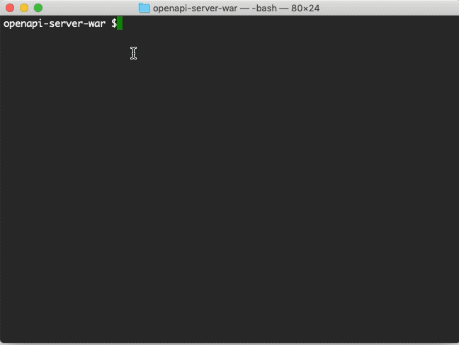

# Web: Use OpenAPI Code Generation tool create a WAR from OpenAPI specification documentation

This sample describes how to use OpenAPI Code Generation tool to create a server stub from OpenAPI specification documentation, 
and package it as a WAR. The resulting archive can then be used in a downstream EventFlow fragment.

* [Add a sample OpenAPI specification YAML file](#add-openapi-specification)
* [Add the OpenAPI generator maven plugin and dependencies](#add-maven-plugin-and-dependecies)
* [Implement the generated interface and add web.xml](#implement-interface-and-add-web.xml)
* [Build this WAR from the command line](#build-this-war-from-the-command-line)

<a name="add-openapi-specification"></a>

## Add a sample OpenAPI specification YAML file 

A web service OpenAPI specification YAML file needs to be provided and is uses as the template to
generate WAR. In this example, we use [api.yaml](../../main/resources/apidoc/api.yaml), which 
defines a **/test** endpoint. This endpoint responses a **Message** object in JSON format when gets called. 
The **Message** object has a single string field.


<a name="add-maven-plugin-and-dependecies"></a>

## Add OpenAPI generator maven plugin and dependencies

The [openapi-generator-maven-plugin](https://mvnrepository.com/artifact/org.openapitools/openapi-generator-maven-plugin) 
is used to support this OpenAPI generator project. The following maven build rule is used:
```xml
    <plugin>
        <groupId>org.openapitools</groupId>
        <artifactId>openapi-generator-maven-plugin</artifactId>
        <executions>
            <execution>
                <goals>
                    <goal>generate</goal>
                </goals>
                <configuration>
                    <!-- specify the OpenAPI yaml -->
                    <inputSpec>${project.basedir}/src/main/resources/apidoc/api.yaml</inputSpec>
                    <!-- target to generate web application code -->                    
                    <generatorName>jaxrs-spec</generatorName>
                    <configOptions>
                        <sourceFolder>src/main/java</sourceFolder>
                        <dateLibrary>java8</dateLibrary>
                        <java8>true</java8>
                        <title>${project.artifactId}</title>
                        <artifactId>${project.artifactId}</artifactId>
                        <interfaceOnly>true</interfaceOnly>
                        <basePackage>com.tibco.ep.samples.web.openapi.server</basePackage>
                        <apiPackage>com.tibco.ep.samples.web.openapi.server.api</apiPackage>
                        <modelPackage>com.tibco.ep.samples.web.openapi.server.model</modelPackage>
                        <returnResponse>true</returnResponse>
                        <useSwaggerAnnotations>false</useSwaggerAnnotations>
                    </configOptions>
                </configuration>
            </execution>
        </executions>
    </plugin>
```

Add the required maven dependencies for the code being generated.  
see details in [pom.xml](../../../pom.xml)


<a name="implement-interface-and-add-web.xml"></a>

## Implement the generated interface and add web.xml

To enable the generated interface, we add [TestApiImpl.java](../../main/java/com/tibco/ep/samples/web/openapi/server/apiimpl/TestApiImpl.java).  
This class implements the **com.tibco.ep.samples.web.openapi.server.api.TestApi.testGet** method, and returns 
a JSON format **com.tibco.ep.samples.web.openapi.server.model.Message** instance with a message **Hello, TIBCO!**.     
We also add [web.xml](../../main/webapp/WEB-INF/web.xml) for supporting servlet mapping. 


<a name="generate-war-archive"></a>

## Generate WAR archive

The project's packaging type is **war**.
```xml
    <groupId>com.tibco.ep.samples.web</groupId>
    <artifactId>openapi-server-war</artifactId>
    <packaging>war</packaging>
    <version>1.0.0</version>

```
The [maven war plugin](https://maven.apache.org/plugins/maven-war-plugin/) is used to build the WAR (.war).  The following maven build rule is used:

```xml
    <plugins>
        <plugin>
            <groupId>org.apache.maven.plugins</groupId>
            <artifactId>maven-war-plugin</artifactId>
        </plugin>
    </plugins>
```

<a name="build-this-war-from-the-command-line"></a>

## Building this sample from the command line

Use the [maven](https://maven.apache.org) as **mvn install** to build from the command line or Continuous Integration system:



---
Copyright (c) 2020, TIBCO Software Inc.

Redistribution and use in source and binary forms, with or without
modification, are permitted provided that the following conditions are met:

* Redistributions of source code must retain the above copyright notice, this
  list of conditions and the following disclaimer.

* Redistributions in binary form must reproduce the above copyright notice,
  this list of conditions and the following disclaimer in the documentation
  and/or other materials provided with the distribution.

* Neither the name of the copyright holder nor the names of its
  contributors may be used to endorse or promote products derived from
  this software without specific prior written permission.

THIS SOFTWARE IS PROVIDED BY THE COPYRIGHT HOLDERS AND CONTRIBUTORS "AS IS"
AND ANY EXPRESS OR IMPLIED WARRANTIES, INCLUDING, BUT NOT LIMITED TO, THE
IMPLIED WARRANTIES OF MERCHANTABILITY AND FITNESS FOR A PARTICULAR PURPOSE ARE
DISCLAIMED. IN NO EVENT SHALL THE COPYRIGHT HOLDER OR CONTRIBUTORS BE LIABLE
FOR ANY DIRECT, INDIRECT, INCIDENTAL, SPECIAL, EXEMPLARY, OR CONSEQUENTIAL
DAMAGES (INCLUDING, BUT NOT LIMITED TO, PROCUREMENT OF SUBSTITUTE GOODS OR
SERVICES; LOSS OF USE, DATA, OR PROFITS; OR BUSINESS INTERRUPTION) HOWEVER
CAUSED AND ON ANY THEORY OF LIABILITY, WHETHER IN CONTRACT, STRICT LIABILITY,
OR TORT (INCLUDING NEGLIGENCE OR OTHERWISE) ARISING IN ANY WAY OUT OF THE USE
OF THIS SOFTWARE, EVEN IF ADVISED OF THE POSSIBILITY OF SUCH DAMAGE.
