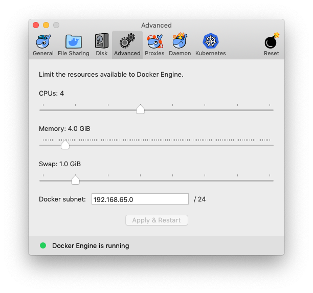
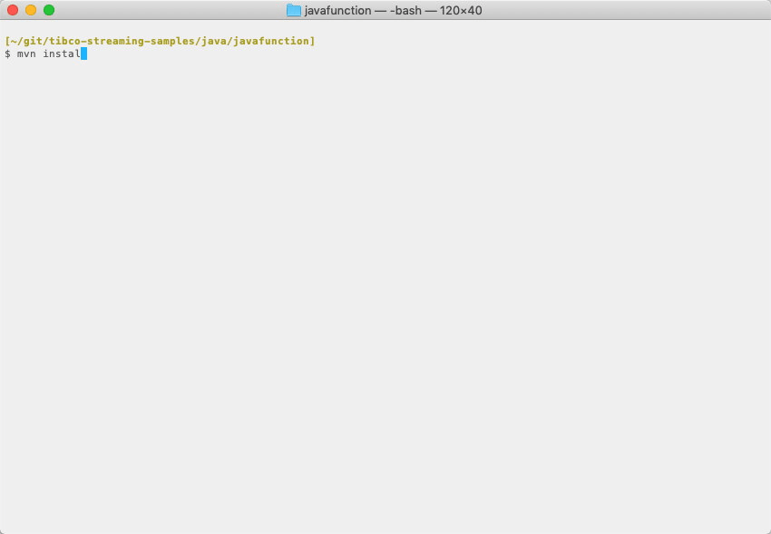

# Web : Prometheus Metrics - APP

This sample describes how to retrieve TIBCO&reg; Streaming Metrics into Prometheus.

## License Activation Configuration

A valid TIBCO Activation Service configuration is required before running any Streaming applications.
This sample contains a license configuration file in `src/main/configurations/license.conf`, which requires
a Maven property `activation.service.urls` be defined with the quoted URL(s) of one or more TIBCO Activation
Service instances. This property may be defined in the properties section of the `pom.xml` file:

    <properties>
        <!-- single activation server -->
        <activation.service.urls>"https://example.com:7070"</activation.service.urls>

        <!-- multiple activation servers -->
        <activation.service.urls>"https://example1.com:7070","https://example2.com:7070"</activation.service.urls>
    </properties>

It may also be defined on the maven command line:

    mvn install -Dactivation.service.urls=\"https://example.com:7070\"
    mvn install -Dactivation.service.urls=\"https://example1.com:7070\",\"https://example2.com:7070\"

Note that the quotes must be escaped on the command line.

It is also possible to define a local license file under the user's home directory, containing the Activation
Service URL(s). However, because a license configuration file in a Streaming application archive takes
precedence over a local license file, the `src/main/configurations/license.conf` file must be deleted from
the project in order for the local license file to be used. Note that the use of local license files is
not recommended for production deployments, because it requires that each machine running Streaming
Application(s) have a local license configuration for the user account under which the node runs.

Refer to the **Welcome Guide > Activation in TIBCO Streaming and Model Management Server** page in the
TIBCO Streaming documentation for more details on license activation.

## Prometheus integration

A node **A** will be started containing the **prometheus-metrics-ef** event flow, itself depending
on the **prometheus-metrics-war** WAR. Upon startup, TIBCO&reg; Streaming will detect the WAR and
deploy it in its administration web engine. The Prometheus REST Endpoint will then begin to serve
Metrics data in a Prometheus consumable way.

## Prerequisites for full testing

The test uses docker to start a Prometheus instance. Therefore, docker must first be downloaded 
and installed - see https://www.docker.com/ for further details. Any recent version of docker 
should suffice, but testing was initially with docker Desktop 2.1.0.4 on MacOS 10.14.6 Mojave.

On MacOS, the resources available to docker may need to be increased beyond the default - see
CPUs and Memory settings on the Advanced tab of Docker preferences.

## Building this sample from the command line and running the integration test cases

In this sample, an integration test is defined in the **pom.xml** file. The test will:

* Start node A
* Start a docker container to run Prometheus. This Prometheus instance is configured to monitor
  metrics from node A through a **prometheus.yml** file.
* Wait for node A to come up
* Trigger the java integration test: it consists in polling the Prometheus instance HTTP
  interface for a builtin TIBCO&reg; Streaming Metric name to come up.
* Stop the Prometheus docker container
* Stop node A

**Warning:** This does not constitute an exhaustive non-functional test plan

Use the [maven](https://maven.apache.org) as **mvn install** to build from the command line or Continuous Integration system :

If docker cannot be found on the machine, the tests will only consists in a start/stop of the 
application, without the Prometheus container start/stop and without the java integration test. 

---
Copyright (c) 2020-2025 Cloud Software Group, Inc.

Redistribution and use in source and binary forms, with or without
modification, are permitted provided that the following conditions are met:

* Redistributions of source code must retain the above copyright notice, this
  list of conditions and the following disclaimer.

* Redistributions in binary form must reproduce the above copyright notice,
  this list of conditions and the following disclaimer in the documentation
  and/or other materials provided with the distribution.

* Neither the name of the copyright holder nor the names of its
  contributors may be used to endorse or promote products derived from
  this software without specific prior written permission.

THIS SOFTWARE IS PROVIDED BY THE COPYRIGHT HOLDERS AND CONTRIBUTORS "AS IS"
AND ANY EXPRESS OR IMPLIED WARRANTIES, INCLUDING, BUT NOT LIMITED TO, THE
IMPLIED WARRANTIES OF MERCHANTABILITY AND FITNESS FOR A PARTICULAR PURPOSE ARE
DISCLAIMED. IN NO EVENT SHALL THE COPYRIGHT HOLDER OR CONTRIBUTORS BE LIABLE
FOR ANY DIRECT, INDIRECT, INCIDENTAL, SPECIAL, EXEMPLARY, OR CONSEQUENTIAL
DAMAGES (INCLUDING, BUT NOT LIMITED TO, PROCUREMENT OF SUBSTITUTE GOODS OR
SERVICES; LOSS OF USE, DATA, OR PROFITS; OR BUSINESS INTERRUPTION) HOWEVER
CAUSED AND ON ANY THEORY OF LIABILITY, WHETHER IN CONTRACT, STRICT LIABILITY,
OR TORT (INCLUDING NEGLIGENCE OR OTHERWISE) ARISING IN ANY WAY OUT OF THE USE
OF THIS SOFTWARE, EVEN IF ADVISED OF THE POSSIBILITY OF SUCH DAMAGE.
