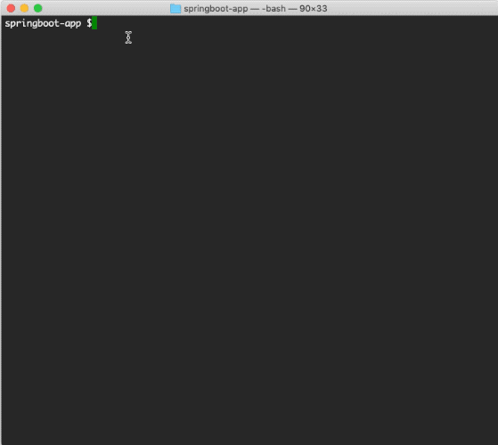
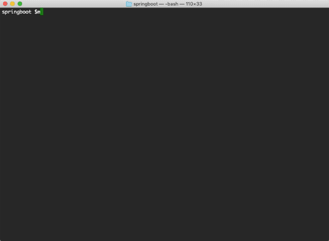

# Web: Using Spring Boot WAR in an EventFlow project

This sample describes how to use a Spring Boot WAR in an EventFlow project.

* [Using Spring Boot to create a WAR file](#using-spring-boot-to-create-a-war-file)
* [Create a no-op EventFlow fragment and declare the WAR as a dependency](#create-an-eventflow-fragment-and-declare-the-war-as-a-dependency)
* [Running this sample from TIBCO StreamBase® Studio](#running-this-sample-from-tibco-streambase-reg-studio)
* [Using "epadmin display web" command to retrieve information about web server](#using-epadmin-display-web-command-to-retrieve-web-help-ui-address)
* [Using HelpUI to send request to test endpoint](#send-request-to-the-test-endpoint-provided-by-the-war)
* [Building this sample from the command line and running the integration test cases](#building-this-sample-from-the-command-line-and-running-the-integration-test-cases)


## Using Spring Boot to create a WAR file
See [springboot-war](../../../../springboot-war/src/site/markdown/index.md).
The WAR provides a GET endpoint which path is **"/springboot-war/test"**.


## Create an EventFlow fragment and declare the WAR as a dependency
In this sample, since the aim is demonstrating how to use a Spring Boot WAR, we use 
a [no-op EventFlow](../../main/eventflow/com/tibco/ep/samples/web/springboot/eventflow/SpringBoot.sbapp), 
which is not related to our demo. Add the WAR into fragment's pom.xml in the same 
way as any other maven dependency:

```xml
    <dependency>
        <groupId>com.tibco.ep.samples.web</groupId>
        <artifactId>springboot-war</artifactId>
        <version>1.0.0</version>
        <type>war</type>
    </dependency>
```


## Running this sample from TIBCO StreamBase&reg; Studio
Use the **Run As -> EventFlow Fragment** menu option to run in TIBCO StreamBase&reg; Studio:


## Using "epadmin display web" command to retrieve Web Help UI Address
The information we need is **Web Help UI Address**




## Send request to the /test endpoint provided by the WAR
Open a web browser, enter **Web Help UI Address**, select **springboot-war** from 
the **Select a Web Service** drop-down list, choose the **GET /test** endpoint and click 
**Try it out**. Then click **Execute** button, a popping up window will ask for user name and password. 
Since we use **default-realm** in this sample, which does NOT require password when a 
connection originates from a trusted address, just enter computer username as the username, and no password is needed, 
then "Hello, TIBCO!" shows up in the **Responses** section with Code 200.


## Building this sample from the command line and running the integration test cases

In this sample, an integration test is defined in the **pom.xml** file. The test will:

* Start node A
* Trigger [SpringBootTest](../../test/java/com/tibco/ep/samples/web/springboot/SpringBootTest.java): it has a Jersey web client which sends a request to the **/springboot-war/test** endpoint of Spring Boot WAR,
  and validates the response is **200_OK** with a message **Hello, TIBCO!**.
* Stop node A

Use the [maven](https://maven.apache.org) as **mvn install** to build from the command line or Continuous Integration system:



---
Copyright (c) 2020-2023 Cloud Software Group, Inc.

Redistribution and use in source and binary forms, with or without
modification, are permitted provided that the following conditions are met:

* Redistributions of source code must retain the above copyright notice, this
  list of conditions and the following disclaimer.

* Redistributions in binary form must reproduce the above copyright notice,
  this list of conditions and the following disclaimer in the documentation
  and/or other materials provided with the distribution.

* Neither the name of the copyright holder nor the names of its
  contributors may be used to endorse or promote products derived from
  this software without specific prior written permission.

THIS SOFTWARE IS PROVIDED BY THE COPYRIGHT HOLDERS AND CONTRIBUTORS "AS IS"
AND ANY EXPRESS OR IMPLIED WARRANTIES, INCLUDING, BUT NOT LIMITED TO, THE
IMPLIED WARRANTIES OF MERCHANTABILITY AND FITNESS FOR A PARTICULAR PURPOSE ARE
DISCLAIMED. IN NO EVENT SHALL THE COPYRIGHT HOLDER OR CONTRIBUTORS BE LIABLE
FOR ANY DIRECT, INDIRECT, INCIDENTAL, SPECIAL, EXEMPLARY, OR CONSEQUENTIAL
DAMAGES (INCLUDING, BUT NOT LIMITED TO, PROCUREMENT OF SUBSTITUTE GOODS OR
SERVICES; LOSS OF USE, DATA, OR PROFITS; OR BUSINESS INTERRUPTION) HOWEVER
CAUSED AND ON ANY THEORY OF LIABILITY, WHETHER IN CONTRACT, STRICT LIABILITY,
OR TORT (INCLUDING NEGLIGENCE OR OTHERWISE) ARISING IN ANY WAY OUT OF THE USE
OF THIS SOFTWARE, EVEN IF ADVISED OF THE POSSIBILITY OF SUCH DAMAGE.
