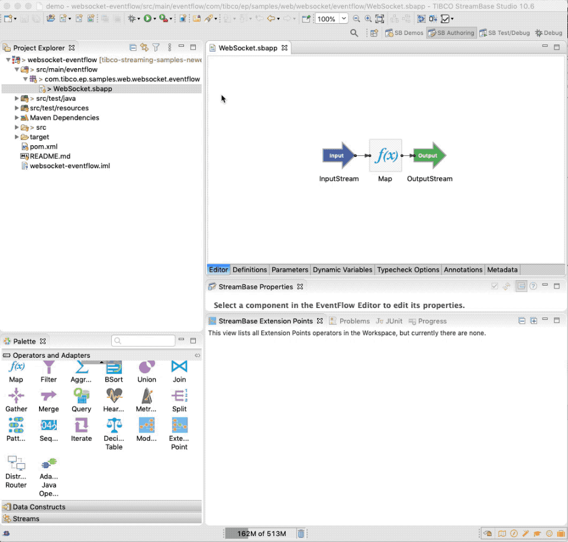
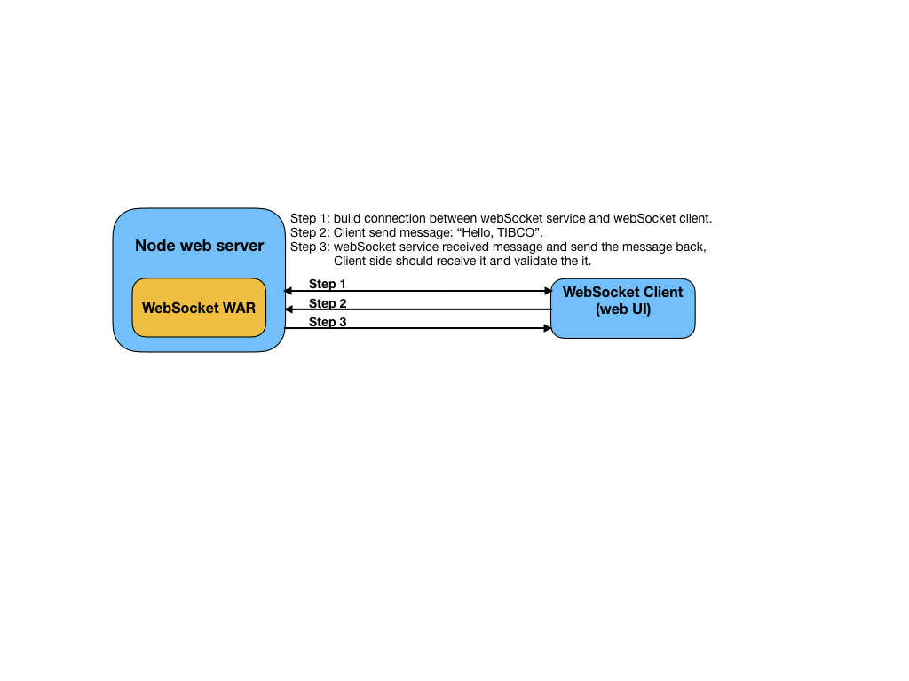

# Web: Using WebSocket WAR in EventFlow project

This sample describes how to use a WAR which has a WebSocket endpoint in an EventFlow project.

* [Create a WAR file which has a web socket endpoint](#create-websocket-endpoint)
* [Create a blank EventFlow fragment and declare the WAR as a dependency](#declare-the-war-as-a-dependency)
* [Running this sample from Spotfire StreamBase Studio&trade;](#running-this-sample-from-tibco-streambase-studiotrade)
* [Using "epadmin display web" command to retrieve information about web server](#using-epadmin-display-web-command-to-retrieve-information)
* [Using "WebSocketClient"  to to connect to the WebSocket endpoint](#using-websocketclient-to-connect-to-the-websocket-endpoint)
* [Building this sample from the command line and running the integration test cases](#building-this-sample-from-the-command-line-and-running-the-integration-test-cases)


<a name="create-websocket-endpoint"></a>

## Create a WAR file which has web socket endpoint
See [websocket-war](../../../../websocket-war/src/site/markdown/index.md).
The WAR provides a GET endpoint which path is **http://<webserver-hostname>:<webserver-port-number>/websocket-war/test**.


<a name="declare-the-war-as-a-dependency"></a>

## Create an EventFlow fragment and declare the WAR as a dependency
In this sample, this sample contains [a no-op EventFlow file](../../main/eventflow/com/tibco/ep/samples/web/websocket/eventflow/WebSocket.sbapp),  
that represent a simply runnable Eventflow fragment.  To use the WAR, just add the WAR into fragment's pom.xml in the same 
way as any other maven dependency:

```xml
    <dependency>
        <groupId>com.tibco.ep.samples.web</groupId>
        <artifactId>websocket-war</artifactId>
        <version>1.0.0</version>
        <type>war</type>
    </dependency>
``` 

<a name="running-this-sample-from-tibco-streambase-studiotrade"></a>

## Running this sample from Spotfire StreamBase Studio&trade;
Use the **Run As -> EventFlow Fragment** menu option to run in Spotfire StreamBase Studio&trade;:



<a name="using-epadmin-display-web-command-to-retrieve-information"></a>

## Using "epadmin display web" command to retrieve web information.
The information we need is **hostname**, **port number**, **web service name**


<a name="using-websocketclient-to-connect-to-the-websocket-endpoint"></a>

## Using [WebSocketClient](../../test/resources/WebSocketClient.html) to connect to the WebSocket endpoint
Open [WebSocketClient](../../test/resources/WebSocketClient.html) file in a web browser which supports WebSocket, 
fill the tables with the information got in last step, since we use **default-realm** in this sample, which does NOT 
require password when a connection originates from a trusted address, no password is entered. 
Then click **connect** button. After connection is built, type message in Message table 
and click **Send Message** button. Click **disconnect** for disconnecting from the WebSocket endpoint.


<a name="building-this-sample-from-the-command-line-and-running-the-integration-test-cases"></a>

## Building this sample from the command line and running the integration test cases

In this sample, an integration test is defined in the **pom.xml** file. The test will:

* Start node A
* Trigger the java integration test: it has a websocket client with is trying to connect to the **/test** endpoint of depolyed websocket-war,
  once the connection is successful, it sends a message **Hello, TIBCO**, and validates the response message contains the 
  same message.
* Stop node A

Use the [maven](https://maven.apache.org) as **mvn install** to build from the command line or Continuous Integration system:


---
Copyright (c) 2020-2023 Cloud Software Group, Inc.

Redistribution and use in source and binary forms, with or without
modification, are permitted provided that the following conditions are met:

* Redistributions of source code must retain the above copyright notice, this
  list of conditions and the following disclaimer.

* Redistributions in binary form must reproduce the above copyright notice,
  this list of conditions and the following disclaimer in the documentation
  and/or other materials provided with the distribution.

* Neither the name of the copyright holder nor the names of its
  contributors may be used to endorse or promote products derived from
  this software without specific prior written permission.

THIS SOFTWARE IS PROVIDED BY THE COPYRIGHT HOLDERS AND CONTRIBUTORS "AS IS"
AND ANY EXPRESS OR IMPLIED WARRANTIES, INCLUDING, BUT NOT LIMITED TO, THE
IMPLIED WARRANTIES OF MERCHANTABILITY AND FITNESS FOR A PARTICULAR PURPOSE ARE
DISCLAIMED. IN NO EVENT SHALL THE COPYRIGHT HOLDER OR CONTRIBUTORS BE LIABLE
FOR ANY DIRECT, INDIRECT, INCIDENTAL, SPECIAL, EXEMPLARY, OR CONSEQUENTIAL
DAMAGES (INCLUDING, BUT NOT LIMITED TO, PROCUREMENT OF SUBSTITUTE GOODS OR
SERVICES; LOSS OF USE, DATA, OR PROFITS; OR BUSINESS INTERRUPTION) HOWEVER
CAUSED AND ON ANY THEORY OF LIABILITY, WHETHER IN CONTRACT, STRICT LIABILITY,
OR TORT (INCLUDING NEGLIGENCE OR OTHERWISE) ARISING IN ANY WAY OUT OF THE USE
OF THIS SOFTWARE, EVEN IF ADVISED OF THE POSSIBILITY OF SUCH DAMAGE.
